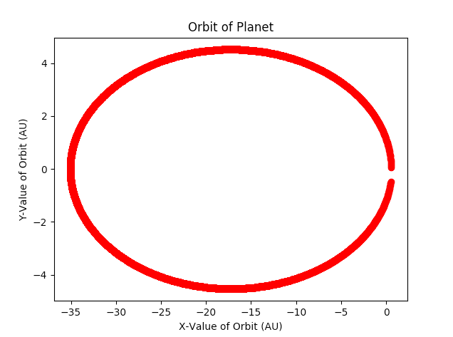

# Brock Mentorship Research
**Project Title**: Study of Celestial Mechanics

**Awards Received**: Astronomy Award, and Niagara College Technician's Award

A Study of Celestial Mechanics was a research done at Brock University under the supervision of Dr. Bozidar Mitrovic of the physics department. A study of celestial mechanics with the use of Python and a library, matplotlib, was used to facilitate the study.
calculations.py are automated calculations using Kepler's laws, and orbit_plot.py is a larger code that will estimate the time elapsed for a celestial mass in orbit to reach a given distance, and plot it.

Also attached is a slideshow that was used to present at a symposium.

# Images
An example output of orbit_plot.py.

